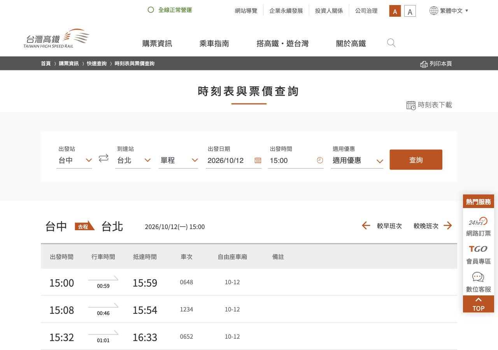
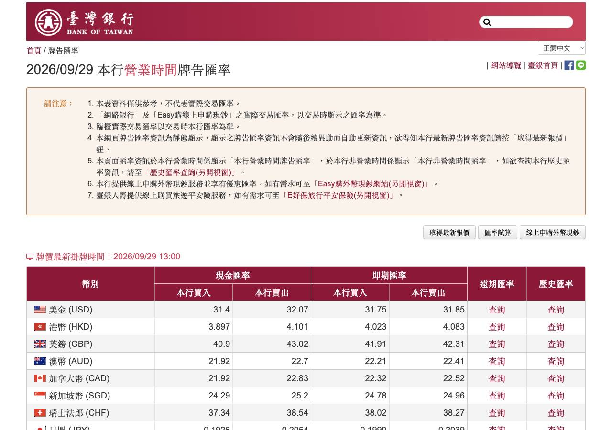
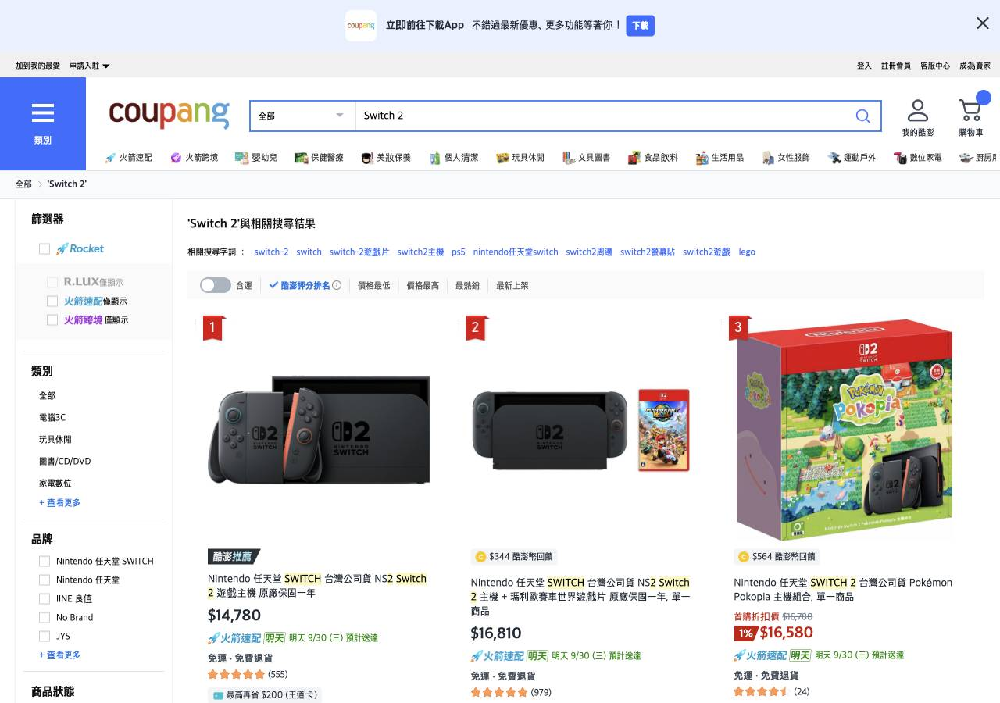
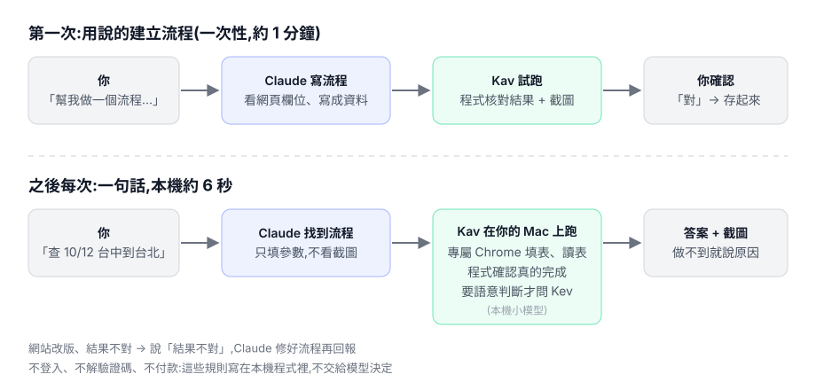

# Kav-FastwebAgent

[繁體中文](README.md) | [English](README.en.md) | **简体中文**

**经常做的网页查询，说一次就变成“流程”;之后一句话，本机约 6 秒跑完，结果由程序核对过。**

让 AI agent 帮你查高铁，它会看截图、点一下、再看截图……每次都从头摸索一遍：两分钟，将近百万 token。
可是你每周查的都是同一个网站、同一张表，只是日期和站名不同。

Kav 的做法是：第一次由 Claude 看懂网页、写成一份“流程”,试跑给你确认；之后同样的事直接在你的 Mac 上用专属 Chrome 执行，
程序负责确认“真的查到了”;需要语义判断(从列表挑哪一条)时,简单的题目可交给本机小模型 [Kev](https://github.com/jaredpalmer/kev)(选配),其余交回给 Claude。网站改版坏了，你只要说“结果不对”,Claude 会修好再汇报。


<sub>同一句话“帮我查 10/12 下午三点以后台中到台北的高铁班次”(台湾高铁)。上:Kav 流程；下:Claude in Chrome 一步步操作。2026-09-29 实测，两边答案都和官网一致。</sub>

## 它能帮你什么

### 如果你不写代码

你只要会说话，再判断结果对不对。

- **重复的查询一句话完成**:列车时刻、今天汇率、几家电商比价、快递追踪、各种“填表 → 查询 → 读结果”的网页。
- **结果附证据**:每次都有截图；查不到、要登录、被网站拦截，它会直接说明原因，不会假装做完。
- **坏了不用找工程师**:说“结果不对，应该是…”,Claude 自己修好流程、重跑、再告诉你改了什么。

### 如果你已经在用 Claude Code / Codex

| 你现在的痛点 | 用 Kav 之后 |
|---|---|
| 让 agent 操作网页很慢，每次都在看截图、试错 | 固定的网页操作变成流程，本机直接跑。高铁查询约 **22 秒 vs 116 秒**(约 5 倍) |
| 一次网页任务烧掉几十万到上百万 token | 同一题输入 token **17.6–26.6 万 vs 77–128 万**(约 4 倍);抓数据不经过模型,判断题只把抓好的文字交给模型 |
| agent 说“完成了”,其实页面还没加载完、读错列 | “完成”由程序判断：加载检测、提交后回读确认、每格附列名、日期必须是今天、价格回商品页再核对一次 |
| 写爬虫要工程师，网站一改版就坏 | 流程是数据(JSON),不是代码；坏了 Claude 按固定方法修 |
| 担心 agent 乱点：登录、付款、绕过验证 | 这些禁止规则写在本机程序里，不交给模型判断 |

### 适合 / 不适合

| 适合 | 不适合 |
|---|---|
| **多步骤、会重复做**的网页操作：填表查询(时刻表、快递、查询系统)、多站搜索比对 | 只做一次的事、单纯打开一页看看(直接用 Claude in Chrome 一样快，台湾银行汇率实测两边都约 20 秒) |
| 固定网址读数据，而且要确认是最新的(今天的汇率、公告) | 登录、付款、下单、识别验证码(不做，这是设计如此) |
| 你在 Kav 专用 Chrome 里自己登录过的网站 | 拦截自动化的网站(例：虾皮)、游戏、非网页的桌面软件 |

## 实际做过的例子

以下都是台湾的网站，因为我们在台湾测试。你可以用任何语言跟 Claude 说。

**台湾高铁时刻(填表查询)**:“查 10/12 下午三点以后台中到台北的高铁”→ 约 6 秒,Kev 调用 0 次。



**台湾银行今天汇率(读固定网页、检查是不是今天的)**:用户一句“帮我做一个流程：查台湾银行今天的美元和日元汇率”,
Claude 从零写出流程，第一次试跑就通过(约 36 秒)。用户再说“加上检查是不是今天的”,之后页面上的挂牌日期不是今天，就会汇报“还没挂牌”,不会拿旧数据充数。



**四家电商比价(搜索 + 语义判断)**:PChome / momo / Yahoo 购物 / 酷澎同时搜索。“主机”和“主机 + 游戏套装”、配件、翻新机的区别由本机 Kev 判断。
Switch 2 一趟 5.6–7.8 秒,Kev 调用 18–31 次、约 6–11 千 token(全在本机)。最低价还会打开商品页再核对一次。



<details>
<summary>数字怎么测的、还不够的地方</summary>

- 对照组：同一句话分别交给“Kav 流程”和“Claude in Chrome 一步步操作”,各开全新的 Claude Code 会话。高铁 Kav 3 次、对照 4 次；台湾银行各 1 次。**样本还小**,5 倍只来自高铁一个网站。
- 建立流程是一次性成本(台湾银行约 36 秒、3 次工具调用);修一次坏掉的流程约 1.2–2.6 万输出 token。修流程目前只在一个网站、两种损坏方式上盲测过。
- 高铁、汇率这两个流程**完全没用到 Kev**,它们的速度来自“流程 + 本机程序”;Kev 目前只在比价这种需要语义判断的流程里发挥作用。
- **Kev 是选配,不是卖点**。2026-10-07 在 591 租房列表(30 条、18 道口语需求)实测“挑哪一条”:Kev 零错选、该停的全停,但两个条件并列或“最便宜”这类题目都会停下,唯一解只答对 4/11;Claude 读同一份文字全对。抓数据这段引擎 31 毫秒,Claude 自己开浏览器做同一件事 21–162 秒、每题 45–91 万 token。所以省时省 token 的是“引擎抓数据”,判断题最划算的做法是交给 Claude;Kev 只在单一属性的题目、或需要离线时有用。记录:`.flightwake/records/261007-pick-judgment-experiment.md`。
- 完整记录在 `.flightwake/records/`(`260929-control-experiment-and-demo`、`260929-kev-usage-accounting`,繁体中文)。

</details>

## 它怎么运作



- **Claude**:理解你的需求、写流程、流程坏了负责修。
- **Kav(本机程序)**:用专属 Chrome 执行流程，判断页面加载好了没、字段有没有填进去、结果是不是真的出现；做不到就返回 `needs_help`,附原因和截图。
- **Kev(本机小模型)**:只回答模糊的判断题，例如“这个商品是主机本体还是套装?”。

## 适合的电脑

Kav 本身(Chrome + 本机程序)很轻，吃资源的是本机小模型 Kev。先看你要跑的流程需不需要 Kev:

| 你要跑的流程 | 需要 Kev 吗 | 建议配置 |
|---|---|---|
| 填表查询、读固定网页(高铁、汇率) | 不需要 | 任何能跑 Chrome 和 Claude Code 的 Mac |
| 比价、需要判断“是不是同一个东西” | 需要 | Apple Silicon(M1 及以后)Mac,**32GB 内存**跑 Kev-4B |

### 选哪个 Kev

| 模型 | 硬件(Kev 官方标注) | 准确率(Kev 官方评测，没训练过的题型) | 建议 |
|---|---|---|---|
| Kev-0.8B | 任何 Apple Silicon Mac | 0.648 | 16GB 的 Mac 可以试；Kav 还没用它实测过 |
| **Kev-4B** | 32GB Mac | 0.817 | **默认**,Kav 的实测都用它 |
| Kev-9B | 32GB Mac | 0.822 | 比 4B 准一点点、模型大一倍，一般不需要 |
| Kev-27B | 80GB 数据中心 GPU | 0.848 | 没有 Mac 版本 |

换模型只要改启动命令的 `--run`,例如 `--run jaredpalmer/kev-0.8b`,Kav 不用改设置。

**我们的实测机器**:Apple M5 Max、36GB 内存。Kev-4B 自动走 MLX(bf16),运行时约占 4.5GB 内存；比价一趟 4 个网站并行,Kev 调用 18–31 次。

**Claude 那端**:我们的实测都用 Claude Opus 5.5。跑已经存好的流程很省(只要填参数);写新流程和修流程更依赖模型能力，其他模型还没测过。

### Mac 要注意的

- **Apple Silicon(M1 及以后)才建议跑 Kev**:Kev 在 Apple Silicon 上自动用 MLX 加速。Intel Mac 没有 MLX,只能用 CPU 跑，会很慢；不用 Kev 的流程不受影响。
- Chrome 要装在默认位置(`/Applications/Google Chrome.app`);装在别处就设置 `KFW_CHROME` 指向它。
- Kav 会另外开一个 Chrome 窗口(专属配置文件、调试端口 9333),不会动到你平常用的 Chrome。

### Windows 要注意的(还没实测)

Kav 目前只在 Mac 上测过。代码没有绑死 macOS,但以下几点一定要处理:

- **Chrome 位置**:默认路径是 Mac 的，要设置 `KFW_CHROME`,例如注册 MCP 时加上
  `-e KFW_CHROME="C:\Program Files\Google\Chrome\Application\chrome.exe"`。
- **文件夹**:截图、流程、Chrome 配置文件会放在 `%USERPROFILE%\.kav-fastweb\`。
- **Kev 需要 NVIDIA 显卡(CUDA)**:Windows 上没有 MLX,没有 GPU 只能用 CPU 跑，实际上太慢。Kev 官方只标注了数据中心 GPU(L4 / L40S / H100),普通游戏显卡能不能跑 4B 我们没测过。
  没有合适的显卡，可以只跑不需要 Kev 的流程；或者在另一台 Mac 上跑 Kev(`--host 0.0.0.0`),再把 `KFW_KEV` 设为 `http://<那台 Mac 的 IP>:8009`。这种做法也还没实测过，而且只适合在家里或公司内网用:Kav 目前不支持 Kev 的 API 密钥。
- 下面的安装命令是 macOS / Linux 的写法;Windows 请在 PowerShell 里照着改，或者直接把“贴给 Claude Code”那段交给它处理。

## 安装

需要:Google Chrome、[uv](https://docs.astral.sh/uv/)、Claude Code。Kev-4B 第一次要下载约 9GB。

### 最简单：把这段贴给你的 Claude Code

````text
请帮我安装 Kav-FastwebAgent,每一步做完告诉我结果：
1. 把 https://github.com/kaiwutech-TW/Kav-FastwebAgent clone 到 ~/Kav-FastwebAgent,在里面执行 uv sync。
2. 问我要不要装 Kev(本机小模型，约 9GB,比价才需要)。要的话：
   git clone https://github.com/jaredpalmer/kev ~/Kav-FastwebAgent/vendor/kev
   然后在 vendor/kev 里执行 uv sync --extra serve
3. 让我在任何文件夹都能用：
   - 用 claude mcp add --scope user kav-fastweb -- uv run --project <~/Kav-FastwebAgent 的绝对路径> python -m kfw.mcp_server 注册 MCP
   - 把 ~/Kav-FastwebAgent/.claude/skills/kav-fastweb 整个文件夹复制到 ~/.claude/skills/
   - 如果这台是 Windows:注册 MCP 时加上 -e KFW_CHROME="<chrome.exe 的完整路径>"
4. 告诉我以后怎么启动 Kev,并提醒我重启 Claude Code。
````

重启 Claude Code 后说“kav 的状态”,它会告诉你 Chrome 和 Kev 有没有在运行。

> 第 3 步(在任何文件夹都能用)还没实测过。目前实测过的用法是：在 Kav 文件夹里打开 Claude Code,项目自带的 `.mcp.json` 和 skill 会自动加载。

### 手动安装

```bash
git clone https://github.com/kaiwutech-TW/Kav-FastwebAgent ~/Kav-FastwebAgent && cd ~/Kav-FastwebAgent && uv sync
# 可选:Kev(比价才需要，第一次下载约 9GB)
git clone https://github.com/jaredpalmer/kev vendor/kev
cd vendor/kev && uv sync --extra serve && uv run --extra serve python -m kev.serve --run jaredpalmer/kev-4b --port 8009
```

在 `~/Kav-FastwebAgent` 打开 Claude Code,批准 `.mcp.json` 里的 `kav-fastweb`。
Chrome 没开的话会自动开一个独立的配置文件(`~/.kav-fastweb/chrome-profile`,不是你平常用的 Chrome)。截图保存在 `~/.kav-fastweb/runs/`。

<details>
<summary>Codex 用户(未实测)</summary>

Kav 是标准的 MCP server,理论上 Codex 也能用。在 `~/.codex/config.toml` 加上：

```toml
[mcp_servers.kav-fastweb]
command = "uv"
args = ["run", "--project", "/你的路径/Kav-FastwebAgent", "python", "-m", "kfw.mcp_server"]
```

再把 `.claude/skills/kav-fastweb` 复制到 Codex 能读到的 skills 文件夹(例如项目里的 `.agents/skills/`)。

</details>

## 设置你固定要做的网页操作

### 1. 用这个句式告诉 Claude

````text
帮我做一个流程：
- 网站:<网址>
- 每次会变的:<例：出发站、到达站、日期>
- 我要看到的结果:<例：车次、出发和到达时间>
- 怎样算对:<选填，例：日期一定要是今天>
````

说不完整也没关系，缺什么 Claude 会一次问完。

### 2. Claude 试跑，给你看结果

Claude 会打开网页看有哪些字段、写好流程、试跑一次，然后给你看重点结果和截图，问“这是你要的结果吗?”。
你只要判断结果对不对：

- 对 → 说“对”,它保存起来，并告诉你以后怎么调用。
- 不对 → 直接说哪里不对(“少了票价”“要看的是现金卖出”),它改好再给你看一次。

### 3. 之后一句话就能用

| 你想… | 就说 |
|---|---|
| 用流程 | 直接问，例如“查 10/20 新竹到台南早上九点以后的高铁” |
| 结果不对、网站改版 | “结果不对，应该是…” → Claude 修好、重跑、再告诉你改了什么 |
| 看有哪些流程 | “我有哪些流程?” |
| 删除流程 | “删掉 <某个> 流程”(移到 `~/.kav-fastweb/trash/`,可以恢复) |
| 用需要登录的网站 | 先在 Kav 专用的 Chrome 窗口里自己登录一次(建议用小号)。Kav 不会替你登录 |

**写流程的小窍门**:“怎样算对”写得越具体，流程越可靠。例如汇率流程加了“日期是今天”,旧数据就不会被当成答案。

### 说不清楚?示范一次给它看(新功能,验收中)

有些网站要点好几页、从列表挑一笔、或用了特殊的菜单,用说的很难讲清楚。这时说“**我示范给你看**”:

1. Claude 在 Kav 的 Chrome 打开网页,你照平常的方式**用一组真实的例子**做一次(不要输入密码、卡号等个人信息)。
2. 结果出现后,按页面上方的“**标记结果**”,点你要的那一块,再按“**完成**”。
3. Claude 把你做的转成流程,在一个**干净的浏览器环境**重播一次:结果必须和你标记的一模一样,才会给你确认、保存。

限制:只能在同一个标签页里操作;打开新标签页、在内嵌框架(iframe)里填表、要输入密码的页面、结果一直在变(价格、剩余名额)的任务,会直接告诉你录不了。
流程坏了、Claude 修两次都修不好时,它也会问你要不要示范一次。

### 不做的事

替你登录、识别验证码、付款或下单、高频大量抓取。有些网站会拦截自动化操作(例：虾皮),遇到时它会停下来告诉你原因，不会尝试绕过。
开着 Cloudflare WARP 或 VPN 时，部分网站(例：酷澎)会拒绝访问。

## 给开发者

Claude 按照 `kav-fastweb` skill(`.claude/skills/kav-fastweb/`)为“网站 × 操作”写**配方**(用户看到的“流程”),试跑通过并附上证据才保存。
MCP 工具:`find_recipe`、`run_recipe`、`inspect_page`、`dry_run`、`save_recipe`、`list_recipes`、`delete_recipe`、`start_recording`、`stop_recording`、`status`。

内置配方在 `recipes/`;用户自己保存的在 `~/.kav-fastweb/recipes/`,同名时以用户的为准。

| 配方 | 类型 | 做什么 |
|---|---|---|
| `tw-shop-compare` | search_compare | PChome / momo / Yahoo 购物 / 酷澎同时比价，返回在商品页验证过的最低价 |
| `thsr-timetable` | form_submit | 台湾高铁时刻表(起讫站、日期、时间 → 车次列表) |

每次执行都返回 `kev`(Kev 调用次数、token、耗时合计)。

### 价格规则

`price` = 任何人都买得到的一次性付清售价。首购价、刷卡返现、积分只放在 `conditional_offers` / `notes`,不参与排序。
价格离中位数太远(< 0.5× 或 > 2×)的商品移到 `suspicious`,不参与排序，需要 Claude 复核。

### 开发

```bash
uv run pytest -q          # 单元测试(价格规则用 83 张真实商品卡片)
uvx pyright               # 类型检查
uv run python tests/mcp_e2e.py "PS5 Pro" "Sony PlayStation 5 Pro 主機(全新)" "ps5pro,playstation5pro;主機"   # 通过 MCP 跑比价配方
uv run python tests/mcp_recipe_flow.py <recipe.json> '<params json>' [--save]   # 按 skill 的流程:dry_run → save → find
```

评测和数字见 `evals/price/README.md`;过程记录在 `.flightwake/`(繁体中文)。
